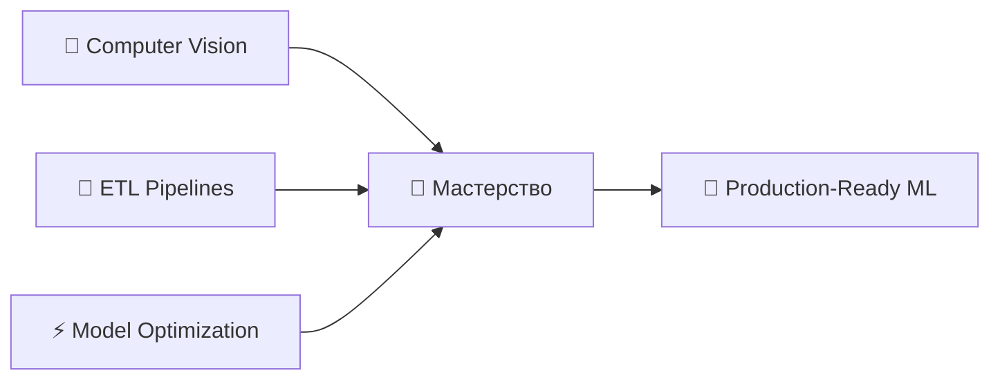

<div align="center">

# 👋 Привет, я Василий — Data Scientist


[](mailto:ecobrainstorming@gmail.com)
[](https://github.com/NeuroLoft)
[](https://skillfactory.ru/)

</div>

---

## 🧠 О NeuroLoft

> **NeuroLoft** — это моя цифровая лаборатория, где структуры данных встречаются с креативностью.  
> Здесь я проектирую потоки данных, обучаю нейронные сети и превращаю сырую информацию в ценные инсайты.

```python
class DataScientist:
    def __init__(self):
        self.name = "Василий Кокорин"
        self.role = "Data Scientist"
        self.location = "Russia 🇷🇺"
        self.motto = "Минимализм, красота и эффективность"
        
    def get_skills(self):
        return {
            "languages": ["Python", "SQL"],
            "ml_frameworks": ["Scikit-learn", "CatBoost", "XGBoost"],
            "dl_frameworks": ["PyTorch", "TensorFlow", "Keras"],
            "data_tools": ["Pandas", "NumPy", "SciPy"],
            "visualization": ["Matplotlib", "Seaborn", "Plotly"],
            "engineering": ["Docker", "Airflow", "PostgreSQL"],
            "interpretability": ["SHAP", "LIME"]
        }
    
    def current_focus(self):
        return [
            "🔭 Исследую архитектуры Computer Vision",
            "🚀 Строю масштабируемые ETL-пайплайны",
            "⚡ Оптимизирую инференс моделей для продакшена"
        ]

me = DataScientist()
```

---

## 🛠️ Технологический стек

<div align="center">

### Языки программирования


### Data Science & ML


### Deep Learning


### Визуализация


### Инфраструктура


### Инструменты


</div>

---

## 📊 GitHub Статистика

<div align="center">


</div>

---

## 🏆 Избранные проекты

<div align="center">

[](https://github.com/NeuroLoft/SF_DATA_SCIENCE)

</div>

### 🔮 [Прогнозирование госфинансирования НКО](https://github.com/NeuroLoft/SF_DATA_SCIENCE)
> Дипломный проект SkillFactory DST-189

**Задача:** Построить ML-модель для прогнозирования вероятности получения грантов и госконтрактов НКО.

**Результаты:**
- ✅ ROC-AUC: **0.78** (превышает baseline на 56%)
- ✅ Подтверждены все статистические гипотезы (χ²-тест, Mann-Whitney)
- ✅ Реализована интерпретация через SHAP values
- ✅ 9+ профессиональных визуализаций

**Стек:** `Python` `Pandas` `Scikit-learn` `CatBoost` `SHAP` `Matplotlib`

---

## 💼 Экспертиза

<table>
<tr>
<td width="50%">

### 📈 Machine Learning
- Классификация (бинарная/мультиклассовая)
- Регрессия (линейная/нелинейная)
- Работа с несбалансированными данными
- Ансамблирование (Bagging, Boosting)
- Feature Engineering
- Hyperparameter Tuning

</td>
<td width="50%">

### 🧪 Статистика & Анализ
- A/B тестирование
- Проверка гипотез (χ², t-test, Mann-Whitney)
- Корреляционный анализ
- EDA (Exploratory Data Analysis)
- Работа с пропусками и выбросами
- Визуализация инсайтов

</td>
</tr>
<tr>
<td width="50%">

### 🔬 Deep Learning
- Computer Vision (CNN)
- Transfer Learning
- Оптимизация архитектур
- Работа с градиентами
- Аугментация данных

</td>
<td width="50%">

### ⚙️ Data Engineering
- ETL/ELT пайплайны
- Оптимизация запросов SQL
- Работа с большими данными
- Docker-контейнеризация
- Оркестрация (Airflow)

</td>
</tr>
</table>

---

## 🎯 Текущий фокус



- 🔭 **Computer Vision:** Изучаю современные архитектуры (ResNet, EfficientNet, Vision Transformers)
- 🚀 **ETL Pipelines:** Проектирую масштабируемые пайплайны обработки данных
- ⚡ **Optimization:** Ускоряю инференс моделей для продакшена (ONNX, TensorRT)

---

## 📚 Образование

🎓 **SkillFactory** — Специализация Data Science (DST-189)  
📅 2024-2025  
💼 Дипломный проект: Прогнозирование получения государственного финансирования НКО

---

## ⚡ Fun Fact

<div align="center">

```python
def neuroloft_philosophy():
    coffee = "strong ☕"
    learning_rate = "just right 📈"
    
    return f"Здесь {coffee} и {learning_rate}"

print(neuroloft_philosophy())
# >>> Здесь strong ☕ и just right 📈
```

</div>

---

## 📫 Связь

<div align="center">

Открыт к интересным проектам и сотрудничеству!

[](mailto:ecobrainstorming@gmail.com)
[](https://github.com/NeuroLoft)

---


</div>

---

<div align="center">

### 💡 *"Минимализм, красота и эффективность"*


</div>
