<div align="center">

# Welcome to NeuroLoft 🧠💡

### *A cozy digital lab for Data Science & Deep Learning experiments*


[](mailto:ecobrainstorming@gmail.com)
[](https://github.com/NeuroLoft)

</div>

---

## 🧪 About The Lab

> **Welcome to my personal workspace where data structures meet creativity.**  
> Here at **NeuroLoft**, I engineer data flows, train neural networks, and turn raw information into valuable insights.

```python
class NeuroLoft:
    def __init__(self):
        self.type = "Digital Lab"
        self.mission = "Data Science & Deep Learning experiments"
        self.location = "Worldwide 🌍"
        self.vibe = "Minimalism, Beauty, Efficiency"
        
    def get_toolkit(self):
        return {
            "core": ["Python", "SQL"],
            "data_science": ["Pandas", "NumPy", "Scikit-learn"],
            "deep_learning": ["PyTorch", "TensorFlow", "Keras"],
            "engineering": ["Docker", "Airflow", "PostgreSQL"],
            "viz": ["Matplotlib", "Seaborn", "Plotly"]
        }
    
    def current_status(self):
        return "Building scalable solutions & Exploring AI frontiers"

lab = NeuroLoft()
```

---

## 🛠 Tech Stack & Tools

<div align="center">

### Core & Data Science


### Deep Learning


### Engineering & Viz


</div>

---

## 🔭 Current Focus

```mermaid
graph LR
    A[👁️ Computer Vision] --> D[🎯 NeuroLoft Goals]
    B[🚀 Scalable ETL] --> D
    C[⚡ Model Inference] --> D
    D --> E[🌍 Digital Nomad Life]
```



*   **Exploring** Computer Vision architectures.
*   **Building** scalable ETL pipelines.
*   **Optimizing** model inference for production.

---

## 📊 GitHub Stats

<div align="center">


</div>

---

## 🏆 Featured Work

<div align="center">

[](https://github.com/NeuroLoft/SF_DATA_SCIENCE)

</div>

### 🔮 [NGO Funding Predictor](https://github.com/NeuroLoft/SF_DATA_SCIENCE)
**Objective:** Predict state funding probability for Non-Profit Organizations using ML.
*   ✅ **ROC-AUC: 0.78**
*   ✅ Statistical Hypothesis Testing
*   ✅ SHAP Interpretability

---

## ⚡ Fun Fact

<div align="center">

> *"Inside NeuroLoft, the coffee is strong, and the learning rate is just right."* ☕📈

</div>

---

<div align="center">

[](mailto:ecobrainstorming@gmail.com)


</div>
