<div align="center">

<!-- Header Banner with "Neuro" Vibe -->


<!-- Typing Effect -->


<!-- Badges -->
[](https://github.com/NeuroLoft)
[](https://github.com/NeuroLoft)

</div>

---

## 🕯️ The Atmosphere

> *Soft neon lights hum in the background. The terminal cursor blinks rhythmically. You've entered **NeuroLoft** — a sanctuary where raw data is refined into intelligence.*

```python
class DigitalLaboratory:
    def __init__(self):
        self.name = "NeuroLoft"
        self.operator = "Digital Nomad"
        self.coordinates = "Decentralized 🌍"
        
    def ambiance(self):
        return {
            "lighting": "Neon Purple & Warm Amber",
            "audio": "Lo-fi Hip Hop / Synthwave",
            "coffee_level": "Critical ☕",
            "gpu_temperature": "Optimal 🔥"
        }
        
    def mission(self):
        return "To explore the latent space between logic and creativity."

lab = DigitalLaboratory()
lab.ambiance()
```

---

## 🧠 Neural Equipment (Tech Stack)

<div align="center">

| **Core Systems** | **Cortex (Deep Learning)** | **Synapses (Data Eng)** |
| :---: | :---: | :---: |
|  |  |  |
|  |  |  |
|  |  |  |

</div>

---

## 📡 Current Transmission

```mermaid
graph TD
    subgraph NeuroLoft [🧠 The Lab]
        A[Input: Raw Reality] --> B(Processing: Computer Vision)
        B --> C{Analysis}
        C -->|Pattern Found| D[Output: Insight]
        C -->|Noise| E[Refine Model]
    end
    style NeuroLoft fill:#0f0c29,stroke:#00f2ff,stroke-width:2px,color:#fff
    style A fill:#2a2a2a,stroke:#b026ff,color:#fff
    style D fill:#2a2a2a,stroke:#00f2ff,color:#fff
```



---

## 📊 Lab Telemetry

<div align="center">


</div>

---

<div align="center">

### *"In the soft violet glow, we weave logic into dreams."*


[](mailto:ecobrainstorming@gmail.com)

</div>

